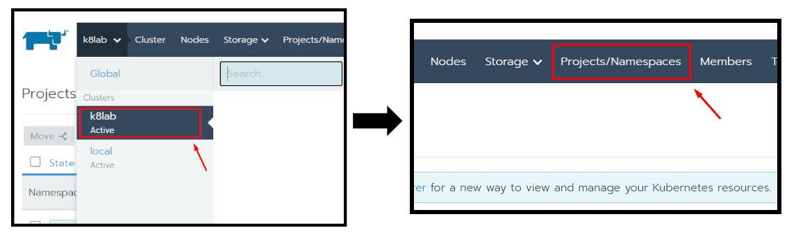
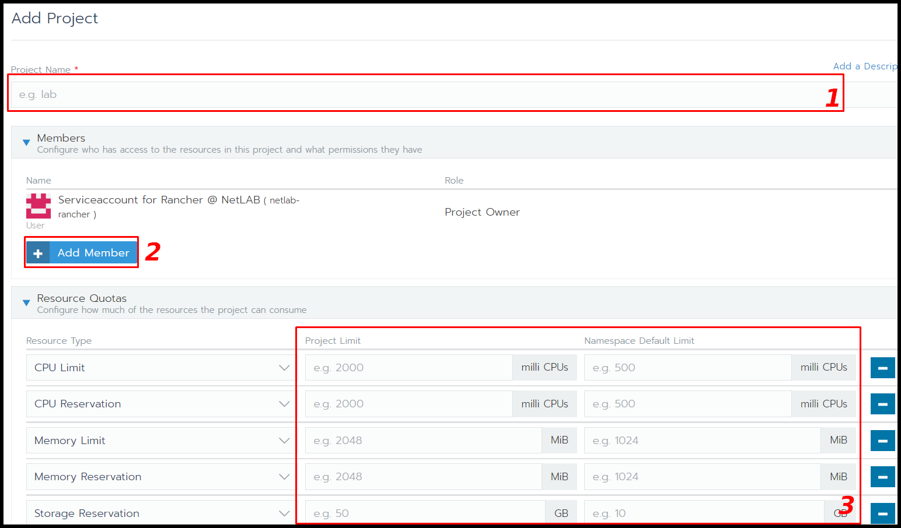

# Einem Studierenden für Rancher Ressourcen bereitstellen

Alle Benutzer mit einem Unix-Account können sich ohne vorherige Aktivierung bei Rancher anmelden. Studierende verfügen zu Anfang über keine Berechtigungen. 

Um für einen Studierenden ein neues Projekt anzulegen, wählen Sie im Cluster Explorer das Cluster `k8lab` aus. Anschließend wählen Sie im Reiter `Projects/Namespaces` aus. 

Durch das Klicken auf`Add Project` können Sie ein eines Projekt anlegen. 

1. Vergeben Sie einen Namen (Studentenkürzel)

2. Fügen Sie den Studenten mit der Gruppe `Studenten Projekt` hinzu.

3. Setzen Sie ein Limit für die Kubernetes Ressourcen fest. 

| Richtwerte für                    | CPU Lim.        | RAM Lim. | Storage |
| --------------------------------- | --------------- | -------- | ------- |
| Let's Encrypt Zertifikat erzeugen | 1100 milli CPUs | 1100 MiB | -       |
| Wordpress                         | 1100 milli CPUs | 1100     | 20 GB   |

| **Kontingentbezeichnung**          | **Beschreibung**                                           |
| ---------------------------------- | ---------------------------------------------------------- |
| CPU-Limit                          | Maximale Anzahl an CPU-Kernen (in milliCPU)                |
| CPU-Reservierung                   | Maximal mögliche Reservierung von CPU-Kernen (in milliCPU) |
| Speicherlimit                      | Maximale Benutzung von RAM (in MiB)                        |
| Speicherreservierung               | Maximal mögliche Reservierung von RAM (in MiB)             |
| Festplattenspeicher (Reservierung) | Größe vom persistenten Speicher (in GB)                    |
| Service Load Balancer              | Anzahl von Load Balancer                                   |
| Service Node Ports                 | Anzahl von Node Ports                                      |
| Pods                               | Anzahl von Pods                                            |
| Services                           | Anzahl von Services                                        |
| Config Maps                        | Anzahl von ConfigMaps                                      |
| Persistent Volume Claims           | Anzahl von Speicher Claims                                 |
| Replication Controllers            | Anzahl von Replikationskontroller                          |
| Secrets                            | Anzahl von Secrets                                         |
