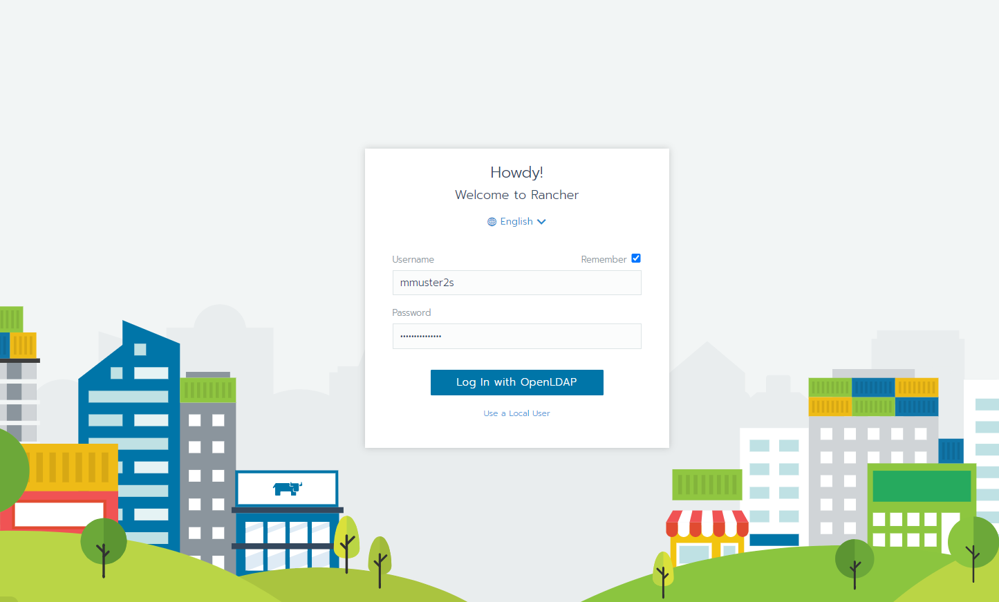
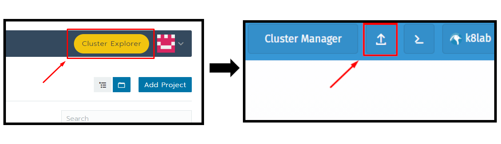
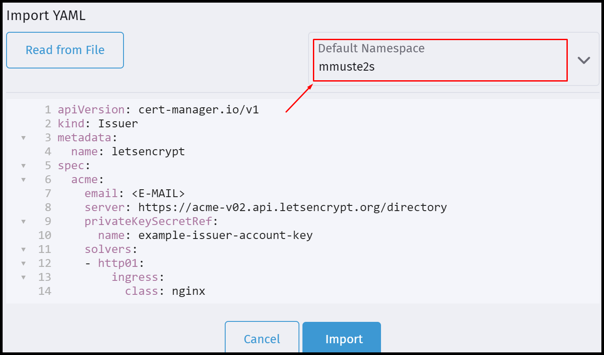

## Bereitstellung von Kubernetes Ressoucen

Die Netzlabore stellen den Studierenden im Rahmen von Projekten, Übungen und Abschlussarbeiten Ressoucen auf einem Kubernetes Cluster zur Verfügung. Jeder Studierende hat die Möglichkeit im Cluster Ressoucen in Form von einem Namespace zu beantragen. Auf dem Cluster betriebene Container sind bei Bedarf aus dem Internet erreichbar. Der Zugriff auf das Kubernetes Cluster efolgt über [Rancher](https://rancher.docklab.de/login).  

## Beantragung von einem Namespace auf dem Cluster

Füllen Sie bitte dieses [Formular]() aus und senden es an die E-Mail-Adresse [netlab@inf.h-brs.de](mailto:netlab@inf.h-brs.de). Sobald wir ihren Namespace erstellt haben, senden wir Ihnen alle weiteren Informationen per E-Mail zu. 

---

## Nutzung vom Cluster

Nachdem Sie von uns eine Bestätigung per E-Mail erhalten haben, stehen Ihnen Ressourcen auf dem Cluster zu Verfügung. Melden sich dich mit ihren Unix-Zugangsdaten (z.B. mmuster2s) bei [Rancher](https://rancher.docklab.de/login) an .



*Abbildung: Beispielhafter Login-Vorgang

Anschließed habe Sie möglichkeit in Ihrem Projekt Namespaces anzulegen und Container zu betreiben. Der Projektname ist dabei ihr Benutzerkürzel (z.B. mmuster2s).

# Let's Encypt Zertifikat erstellen

Über den Dienst `cert-manager` haben Sie die Möglichkeit eigene Let's Encypt Zertifikate für Ihre Webanwendugen zu erzeugen. Als Vorraussetzung benötigen Sie eine eigene Internet Domain.

## 1. Zertifikatsinformationen hinterlegen

Öffnen Sie im Cluster-Expolorer die YAML Eingabe.



Anschließend kopieren Sie den Text aus der Codebox in den YAML Editor und ersetzen das Attribute <E-MAIL> durch Ihre eigene E-Mail Adresse. Diese E-Mail Adresse wird benutzt um bei das Zertifikat bei Let's Encrypt zu erzeugen. 

```
apiVersion: cert-manager.io/v1
kind: Issuer
metadata:
  name: letsencrypt
spec:
  acme:
    email: <E-MAIL>
    server: https://acme-v02.api.letsencrypt.org/directory
    privateKeySecretRef:
      name: example-issuer-account-key
    solvers:
    - http01:
        ingress:
          class: nginx
```

Bitte achten Sie darauf Ihren Namespace anzugeben.



## 2. Zertifikat erzeugen

Anschließend kopieren Sie den Text aus der Codebox und ersetzen Sie die Attribute `example.com` durch Ihre Domain oder Sub-Domain.

```
apiVersion: cert-manager.io/v1
kind: Certificate
metadata:
  name: example.com
spec:
  secretName: tls-example.com
  dnsNames:
  - example.com
  issuerRef:
    name: letsencrypt
    kind: Issuer
```

Nachdem Sie den YAML Text importiert habe, wird ein Zertifikat erzeugt. Dies kann eine Minute dauern. Anschließen wird das Zertifikat als Secret im Namespace angelegt. Sollte kein Zertifikat erzeugt werden, suche sie nach den Ressourcen `certificatrequest`,`order` und `challenges` um Hinweise für den Grund zu bekommen.

## 3. Zertifikat auf Webdienst anwenden

Das Zertifikat müssen Sie nun in der Ingress Ressource hinterlegen.
